# ReAct-Gated Mixture-of-Agents

[](https://www.python.org/downloads/)
[](https://opensource.org/licenses/MIT)

## 🚀 Overview

**ReAct-Gated Mixture-of-Agents** is an advanced agentic system that implements a master agent orchestrating multiple sub-agents (OpenAI, Gemini, Groq, etc.) using the ReAct pattern. The master agent intelligently delegates tasks to specialized sub-agents, which can use their native tools (function calling) or custom tools provided via MCP (Model Context Protocol).

### Core Capabilities

*   **Master Agent (ReAct)**: Orchestrates sub-agents with intelligent task delegation
*   **Sub-Agent Support**: OpenAI, Google Gemini, Groq, Ollama, HuggingFace
*   **Tool Integration**: Sub-agents can use default provider tools or custom tools via MCP
*   **Stateful Workflows**: Persistent, resumable sessions with SQLite checkpointing
*   **Long-Term Memory**: Conversation summarization prevents prompt explosion while preserving context

## 🏗️ Architecture

### System Architecture

The system implements a **multi-node LangGraph workflow** with a master agent orchestrating sub-agents:

```mermaid
graph TD
    %% Nodes definition
    User([👤 User Query])
    
    subgraph Loop["🔄 Reasoning Loop"]
        direction TB
        Master[("🤖 Master Agent<br/>(ReAct Orchestrator)")]
        Tools["🛠️ Tool Gateway<br/>(Delegate & Aggregate)"]
        Memory["📝 Memory Manager<br/>(Summarize Context)"]
    end
    
    SubAgents["🌐 Sub-Agents Ecosystem<br/>OpenAI • Gemini • Groq • Ollama • HF"]
    
    Output([🚀 Final Response])

    %% Flow Connections
    User --> Master
    
    Master -- "Needs Expertise" --> Tools
    Master -- "Answer Ready" --> Output
    
    Tools -.->|"Invoke API"| SubAgents
    SubAgents -.->|"Return Result"| Tools
    
    Tools -- "Continue" --> Master
    Tools -- "Context Full" --> Memory
    Memory --> Master

    %% Styling
    classDef default fill:#fff,stroke:#333,stroke-width:1px;
    classDef highlight fill:#e1f5fe,stroke:#01579b,stroke-width:2px;
    classDef agent fill:#fff3e0,stroke:#e65100,stroke-width:2px;
    classDef tool fill:#f3e5f5,stroke:#4a148c,stroke-width:2px;
    
    class User,Output highlight;
    class Master agent;
    class Tools,Memory tool;
    class SubAgents default;
    style Loop fill:#fafafa,stroke:#ccc,stroke-dasharray: 5 5
```



### Key Components

1. **Master Agent Node** (`agentic/workflow/nodes/agent_node.py`):
   - **Input**: `conversation_summary` (string, long-term memory) + `messages` (list, recent context)
   - **Process**: ReAct agent analyzes context, selects appropriate sub-agents, crafts tailored prompts
   - **Output**: `AIMessage` with `tool_calls` (sub-agent invocations) OR `content` (final answer)
   - **State Updates**: `messages`, `next_action`, `final_output`, `iteration_count`
   - **Safety**: Maximum iteration limit (100) to prevent infinite loops

2. **Tool Node** (`agentic/workflow/nodes/tool_node.py`):
   - **Input**: `messages` (extracts `tool_calls` from last `AIMessage`)
   - **Process**: Retrieves sub-agent tools from `ToolRegistry`, executes each tool call (invokes sub-agents)
   - **Tools Available**: 
     - `invoke_openai_sub_agent`: Invoke OpenAI sub-agent (GPT-4, GPT-3.5)
     - `invoke_google_gemini_sub_agent`: Invoke Google Gemini sub-agent (Gemini Pro, Gemini 3.0)
     - `invoke_sub_agent_tool`: Generic sub-agent invocation (Groq, Ollama, HuggingFace)
   - **Output**: `ToolMessage` list with sub-agent responses
   - **Error Handling**: Graceful failure with error messages in `ToolMessage`
   - **Next Step**: Routes to either `summarize` (if message_count >= 15) or `agent` (continue)

3. **Summary Node** (`agentic/workflow/nodes/summary_node.py`):
   - **Trigger**: Only after `tool_node` when `len(messages) >= SUMMARY_THRESHOLD` (15 messages)
   - **Input**: Recent messages + existing `conversation_summary`
   - **Process**: LLM-based summarization (temperature: 0.1 for factual accuracy)
   - **Output**: Condensed summary preserving key findings
   - **Memory Management**: Clears old messages, keeps last 3 for immediate context
   - **Next Step**: Always routes back to `agent` with updated summary

4. **Sub-Agent Services** (`services/agentic/`):
   - **SubAgentService**: Service for invoking sub-agents with prompts and tools
   - **SubAgentFactory**: Factory for creating sub-agent instances
   - **MCP Integration**: Support for custom tools via Model Context Protocol

5. **State Management** (`agentic/workflow/state.py`):
   - **GraphState**: TypedDict with `messages`, `conversation_summary`, `user_query`, `final_output`, `next_action`, `error_message`, `iteration_count`
   - **Checkpointing**: SQLite-based persistence via `services/storage/checkpointer.py`
   - **Resumability**: Thread-based state recovery for long-running sessions

### Sub-Agent Tools

The master agent has access to tools for invoking sub-agents:

- **`invoke_openai_sub_agent`**: Specialized tool for OpenAI sub-agents
  - Supports GPT-4, GPT-3.5, and other OpenAI models
  - Can use OpenAI's native function calling
  - Optional MCP tools support

- **`invoke_google_gemini_sub_agent`**: Specialized tool for Google Gemini sub-agents
  - Supports Gemini Pro, Gemini 3.0, and other Gemini models
  - Can use Gemini's native function calling
  - Optional MCP tools support

- **`invoke_sub_agent_tool`**: Generic tool for any sub-agent provider
  - Supports Groq, Ollama, HuggingFace, and other providers
  - Flexible configuration per invocation
  - Optional MCP tools support

### Tool Configuration for Sub-Agents

When the master agent invokes a sub-agent, it can:

1. **Provide a tailored prompt**: Craft specific instructions for the sub-agent
2. **Enable MCP tools**: Set `use_mcp_tools=True` to provide custom tools via MCP
3. **Use default tools**: Sub-agents automatically have access to their provider's native tools (e.g., function calling for OpenAI/Gemini)
4. **Configure parameters**: Override temperature, model name, etc. per invocation

## 🛠️ Tech Stack

- **LLM Orchestration**: LangGraph
- **Agent Framework**: LangChain (ReAct pattern)
- **Sub-Agent Providers**: OpenAI, Google Gemini, Groq, Ollama, HuggingFace
- **State Management**: SQLite (for LangGraph checkpoints, local, no server required)
- **LLM Providers**: OpenAI, Hugging Face, Ollama, Groq, Google Gemini (centralized factory)
- **API**: FastAPI, Uvicorn
- **Experiment Tracking**: Weights & Biases
- **MCP Support**: Model Context Protocol integration (placeholder for custom tools)

## 📁 Directory Structure

```
src/
├── services/        # Reusable technical services
│   ├── llm.py       # LLM factory (OpenAI, HuggingFace, Ollama, Groq, Google Gemini)
│   ├── agentic/     # Sub-agent services
│   │   ├── sub_agent_service.py
│   │   ├── sub_agent_factory.py
│   │   └── mcp_integration.py
│   ├── storage/     # SQLite (checkpoints), Checkpointer
│   └── evaluation/  # Evaluation services (synthesis)
├── agentic/         # Agentic system
│   ├── agents/      # Master agent, prompts, and constants
│   ├── tools/       # Sub-agent tools with registry pattern
│   └── workflow/    # LangGraph workflow (graph, runner, nodes, routing, state)
└── application/     # User interfaces
    ├── api/         # FastAPI REST API
    └── cli/         # Command-line interface scripts
```

## ⚙️ Installation & Setup

### Prerequisites

- **Python 3.11+**
- **Poetry**: Dependency management (required)
- **API Keys**: At least one of:
  - OpenAI API Key (for OpenAI sub-agents)
  - Google API Key (for Gemini sub-agents)
  - Groq API Key (for Groq sub-agents)
  - Or other provider API keys

### Installation

1. **Clone repository**:
   ```bash
   git clone <repository-url>
   cd ragmoa
   ```

2. **Configure environment**:
   ```bash
   cp .env.example .env
   ```
   
   Edit `.env` and add your API keys:
   ```env
   OPENAI_API_KEY=your_openai_key
   GOOGLE_API_KEY=your_google_key
   GROQ_API_KEY=your_groq_key
   ```

3. **Install dependencies**:
   ```bash
   poetry install
   ```

4. **Set up SQLite (for LangGraph checkpoints)**:

   SQLite is used for storing LangGraph conversation checkpoints (state management). No setup required! The database is automatically created at `data/checkpoints.sqlite` by default.

   **Note**: SQLite is a lightweight, serverless database that requires no configuration. All checkpoint data is stored locally in a single file.

5. **(Optional) Connect to Weights & Biases**:
   ```bash
   poetry run wandb login
   ```

## 🚀 Usage

### 1. Run Mixture-of-Agents Workflow

Submit a query to the master agent:

```bash
poetry run python -m src.application.cli.run_ragmoa \
  --query "Explain quantum computing in simple terms"
```

**Options:**
- `--query` / `-q`: User query (required)
- `--thread_id` / `-t`: Optional thread ID to resume a previous session
- `--log_level`: Logging level (DEBUG, INFO, WARNING, ERROR, CRITICAL)

### 2. Run Evaluations

Evaluate system performance (synthesis evaluation):

```bash
poetry run python -m src.application.cli.run_evaluation \
  --synthesis_dataset data/evaluation/synthesis_eval_dataset.json
```

**Options:**
- `--synthesis_dataset`: Path to synthesis evaluation dataset (required)
- `--judge_llm_model`: Optional LLM model to use as judge
- `--wandb_project`: W&B project name (default: Mixture-of-Agents-Evaluations)
- `--wandb_disabled`: Disable W&B logging

### 3. API Server

Start the FastAPI server:

```bash
poetry run uvicorn src.application.api.main:app --reload --host 127.0.0.1 --port 8000
```

Access:
- API: `http://localhost:8000`
- Swagger UI: `http://localhost:8000/docs`
- ReDoc: `http://localhost:8000/redoc`

**Example API request:**
```bash
curl -X POST "http://localhost:8000/invoke_moa" \
  -H "Content-Type: application/json" \
  -d '{"query": "Explain quantum computing in simple terms"}'
```

## 🐳 Docker

### Docker Compose

```bash
# Start all services
docker-compose up -d

# Stop services
docker-compose down

# View logs
docker-compose logs -f
```

**Services:**
- `cli`: CLI commands
- `api`: FastAPI on http://localhost:8000

**CLI Usage Examples:**

```bash
# Use run --rm for CLI commands (creates a temporary container):

docker-compose run --rm cli python -m src.application.cli.run_ragmoa \
  --query "Explain quantum computing in simple terms"
```

**API Access:**
- API: http://localhost:8000
- Swagger UI: http://localhost:8000/docs

## 🔧 Configuration

### Sub-Agent Configuration

Configure sub-agents in `config/settings.py` or via environment variables:

```python
# Enabled sub-agents
ENABLED_SUB_AGENTS = ["openai", "google", "groq"]

# Default sub-agent provider
DEFAULT_SUB_AGENT_PROVIDER = "openai"

# MCP Configuration
MCP_ENABLED = False  # Enable MCP tool integration
MCP_SERVER_NAME = None  # Default MCP server name
```

### Master Agent Configuration

```python
# Master agent temperature
AGENT_TEMPERATURE = 0.3

# Sub-agent default temperature
SUB_AGENT_TEMPERATURE = 0.3

# Summary threshold
SUMMARY_THRESHOLD = 15  # Messages before summarization
```

## 📄 License

MIT License - Copyright (c) 2025 Estèphe ARNAUD

## 🤝 Contributing

Contributions are welcome! Please feel free to submit a Pull Request.
